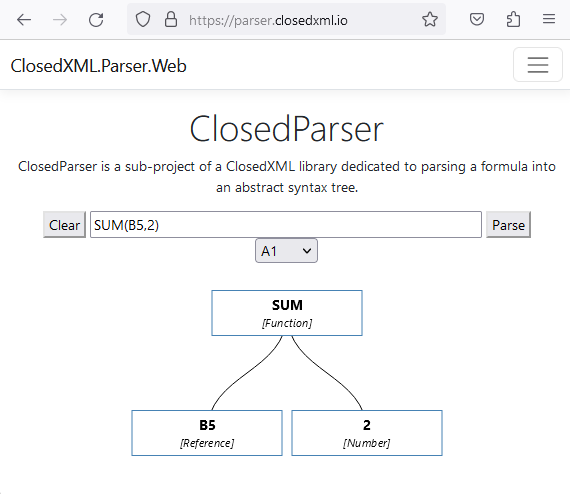

# ClosedParser

> **Fork notice**
>
> This repository is a fork of [ClosedXML.Parser](https://github.com/ClosedXML/ClosedXML.Parser), Copyright (c) 2023, Jan Havlíček.
>
> The sole purpose of this fork is to bundle some fixes needed by the XLibur library, published as the `XLibur.ClosedXML.Parser` NuGet package. We aim to push pull requests with these fixes back to upstream ClosedXML.Parser.

ClosedParser parses Excel formulas, in the form that OOXML files store them, into an abstract syntax tree that can be evaluated.

Official source for the grammar is [MS-XLSX](https://learn.microsoft.com/en-us/openspecs/office_standards/ms-xlsx/2c5dee00-eff2-4b22-92b6-0738acd4475e), chapter 2.2.2 Formulas. The provided grammar is not usable for parser generators, it's full of ambiguities and the rules don't take into account operator precedence. A copy of the v20221115 grammar is in *docs/grammar*, together with a copy annotated with notes from the start of the project.

# How to use

Install the `XLibur.ClosedXML.Parser` NuGet package.

* Implement the `IAstFactory<TScalarValue, TNode, TContext>` interface. The parser calls it for each node, with the range of the formula text that the node was parsed from. *src/ClosedXML.Parser.Ast/AstFactory.cs* is an example; the tests and the visualizer use it.
* Call a parsing method. The parser passes the context to each method of the factory.
  * `FormulaParser<TScalarValue, TNode, TContext>.CellFormulaA1("SUM(A1, 2)", context, factory)`
  * `FormulaParser<TScalarValue, TNode, TContext>.CellFormulaR1C1("SUM(R1C1, 2)", context, factory)`
* A formula that does not satisfy the grammar throws a `ParsingException`.

## Visualizer
There is a visualizer to display AST in a browser at **[https://xlibur.github.io/ClosedXML.Parser/](https://xlibur.github.io/ClosedXML.Parser/)**. It runs the parser from the `develop` branch in the browser with Blazor WebAssembly. See [docs/visualizer-design.md](docs/visualizer-design.md).

# Goals

* __Performance__ - ClosedXML needs to parse formula really fast. Limit allocation and so on.
* __Evaluation oriented__ - Parser should concentrates on creation of abstract syntax trees, not concrete syntax tree. Goal is evaluation of formulas, not transformation.
* __Multi-use__ - Formulas are mostly used in cells, but there are other places with different grammar rules (e.g. sparklines, data validation)
* __Multi notation (A1 or R1C1)__ - Parser should be able to parse both A1 and R1C1 formulas. I.e. `SUM(R5)` can mean return sum of cell `R5` in _A1_ notation, but return sum of all cells on row 5 in _R1C1_ notation.

The ANTLR4 grammars in *src/ClosedXML.ANTLR* are the source of truth. The lexer grammar, *FormulaLexer.g4*, is converted to the grammars of the Rolex DFA lexer that the parser uses (see [Rolex](#rolex)). The parser grammar, *FormulaParser.g4*, is the basis of the recursive descent parser. The package does not use the ANTLR runtime: only the tests use the ANTLR lexer and parser, to check that the parser agrees with the grammar. Upstream measured the ANTLR parser at 8 seconds for the Enron data set, and the recursive descent parser at 700 ms.

ANTLR4 one of few maintained parser generators with C# target.

Upstream ClosedXML has replaced XLParser with ClosedXML.Parser, and the XLibur library uses the `XLibur.ClosedXML.Parser` package of this fork.

## Current performance

The data set tests print how long the parse took. In Release mode, on .NET 10 and an AMD Ryzen 9 5950X (measured 2026-09-12), with the AST factory of the tests:

* Enron: *946320* formulas in 1.6 to 1.8 s, *1.7 to 1.9 μs* per formula
* EUSES: *89295* formulas in 0.12 to 0.15 s, *1.4 to 1.7 μs* per formula

Upstream measured 1.942 μs per formula for Enron. To measure again:

`dotnet test src/ClosedXML.Parser.Tests -c Release -f net10.0 --filter "FullyQualifiedName~DataSetTests" --logger "console;verbosity=detailed"`

2μs per formula should be something like 6000 instructions (under unrealistic assumption 1 instruction per 1 Hz), so basically fast enough.

## Limitations

The primary goal is to parse formulas stored in file, not user supplied formulas. The formulas displayed in the GUI is not the same as formula stored in the file. Several examples:
* The IFS function is a part of future functions. In the file, it is stored as `_xlfn.IFS`, but user sees `IFS`
* In the structured references, user sees @ as an indication that structured references this row, but in reality it is a specifier `[#This Row]`

Therefore:
* External references are accepted only in form of an index to an external file (e.g. `[5]Sheet1!A1`). `[Book1.xlsx]Sheet1!A1` does not parse.
* A quoted item after an external file index, such as `[1]!'Some name in external wb'`, is read as a dynamic data exchange (DDE) item, because that is how a file stores a DDE link. A name in an external file parses only without quotes, e.g. `[1]!SomeName`.
* Other formula implementations have a slightly different grammar, incompatible with OOXML formulas. They are out of scope of the project.

The parser also does not parse a call of a function result, such as `LAMBDA(x,x+1)(2)`.

# Why not use XLParser

ClosedXML used [XLParser](https://github.com/spreadsheetlab/XLParser) and transformed its concrete syntax tree to an abstract syntax tree, until it replaced XLParser with ClosedXML.Parser. The reasons, as upstream measured them:

* Speed:
  * Grammar extensively uses regexps extensively. Regexs are slow, especially for NET4x target, allocates extra memory. XLParser takes up _47_ seconds for Enron dataset on .NET Framework. .NET teams had made massive improvements on regexs, so it takes only _16_ seconds on NET7.
  * IronParser needs to determine all possible tokens after every token, that is problematic, even with the help of `prefix` hints.
* AST: XLParser creates concentrates on creation of concrete syntax tree, but for ClosedXML, we need abstract syntax tree for evaluation. IronParser is not very friendly in that regard
* ~~XLParser uses `IronParser`, an unmaintained project~~ (IronParser recently released version 1.2).
* Doesn't have support for lambdas and R1C1 style.

ANTLR lexer takes up about 3.2 seconds for Enron dataset. With ANTLR parsing, it takes up 11 seconds. I want that 7+ seconds in performance and no allocation, so RDS that takes up 700 ms.

## Debugging

Use [vscode-antlr4](https://github.com/mike-lischke/vscode-antlr4/blob/master/doc/grammar-debugging.md) plugin for debugging the grammar.

## Testing strategy

* Each token that contains some data that are extracted for a node (e.g. `A1_REFERENCE` `C5` to `row 5`, `column 3`) has a separate test class in `Lexers` directory with a `{TokenPascalName}TokenTests.cs`
* Each parser rule has a test class in `Rules` directory. It should contain all possible combinations of a rule and comparing it with the AST nodes.
* Data set tests are in `DataSetTests.cs`. They parse each formula of the Enron, EUSES and contributions data sets. A formula listed in the `known-fails.csv` of its data set must fail, and every other formula must parse. There is no check of the output. Each data set is a directory in `data`, with its formulas in a one column CSV file, `formulas.csv`.
* `AntlrCompatibilityTests.cs` checks that the Rolex lexer and the ANTLR lexer produce the same tokens for the data sets.
* `ClosedXML.Parser.Visualizer.Tests` tests the visualizer.

## Rolex

Rolex is a DFA based lexer released under MIT license (see [Rolex: Unicode Enabled Lexer Generator in C#
](https://www.codeproject.com/Articles/5257489/Rolex-Unicode-Enabled-Lexer-Generator-in-Csharp)). ANTLR is still the source of truth, but it is used to generate Rolex grammar and then DFA for a lexer.

It is rather complicated, but upstream measured it as two times faster than the ANTLR lexer (1.9 us vs 3.676 us per formula).

## Generate lexer

Prepare rolex grammars

The converter in *tools/Antlr2Rolex* generates both Rolex grammars from *FormulaLexer.g4*. Never edit a *.rl* file by hand: `RolexGrammarConverterTests` regenerates both and fails when a committed file differs.

* `dotnet run --project tools/Antlr2Rolex -- src/ClosedXML.ANTLR/FormulaLexer.g4 --style A1 --output src/ClosedXML.Parser/Rolex/LexerA1.rl`
* `dotnet run --project tools/Antlr2Rolex -- src/ClosedXML.ANTLR/FormulaLexer.g4 --style R1C1 --output src/ClosedXML.Parser/Rolex/LexerR1C1.rl`

The R1C1 style uses the *Local R1C1 References* section of the grammar instead of the *Local A1 References* section. It drops each alternative that refers to a rule only the A1 section defines, and prints a warning for each one (today that is the `A1_RELATIVE_COLUMN ':' SHEET_NAME` alternative of `SHEET_RANGE`). The converter supports only the ANTLR syntax the grammar uses now, and reports anything else with its line.

Generate the DFA tables

`tools/rolex/generate-dfa-tables.sh` regenerates *RolexA1Dfa.cs* and *RolexR1C1Dfa.cs* from the Rolex grammars with the vendored Rolex build in *tools/rolex/91a2d6d*, the only build whose output matches the tables. It is a .NET Framework executable, so run the script from Git Bash on Windows. With `--check` it changes nothing and fails when a committed table differs. The `rolex-tables` CI job runs it that way, so a Rolex grammar committed without its regenerated table fails the build. *tools/rolex/README.md* records how that build was made.

# Resources

* [MS-XLSX](https://learn.microsoft.com/en-us/openspecs/office_standards/ms-xlsx/2c5dee00-eff2-4b22-92b6-0738acd4475e)
* [Simplified XLParser grammar](https://github.com/spreadsheetlab/XLParser/blob/master/doc/ebnf.pdf) and [tokens](https://github.com/spreadsheetlab/XLParser/blob/master/doc/tokens.pdf).
* [Getting Started With ANTLR in C#](https://tomassetti.me/getting-started-with-antlr-in-csharp/)
